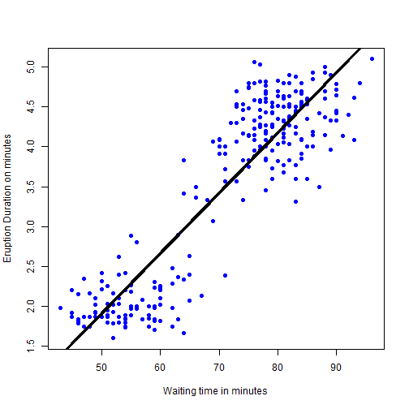

## Visiting Old Faithful in a hurry

Finishing your internship at Seattle, you are passing within a few miles of Yellowstone as you drive back to Chicago.

Wouldn't it be a great addition to your summer to visit Old Faithful - a legendary geyser erupting on a schedule?

This App helps you determine your wait times at the geyser

--- .class #id 

## Old Faithful App

Eruption data has been collected over a period of time. 

A linear regression model has been built with the data. 

Predictions are made based on this data model.

The App lets you estimate your time at the geyser

--- .class #id 
## The Model
The App uses the following model
 

--- .class #id 

## Try the app yourself

 https://savithridevaraj.shinyapps.io/DataProducts

Input your wait time in the text box (x-axis variable), and the output will tell you the probable duration of eruption (y-axis) you may be able to see.

Thank you for visiting!

